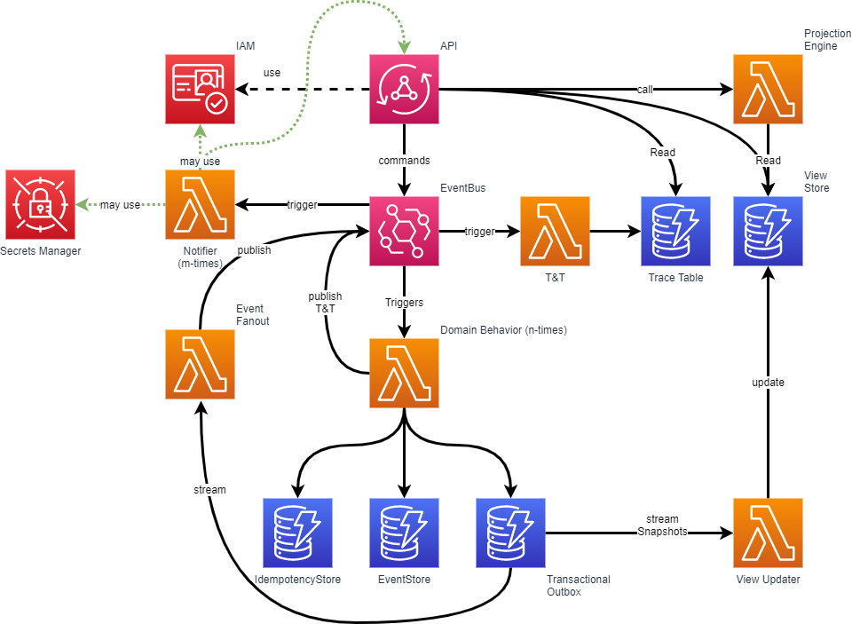

# Technical Architecture

This diagram outlines the following components and interactions and visualizes the technical architecture to where the
model is converted to:

1. **Secrets Manager**: Manages sensitive information and can be accessed by the **Notifier Lambda** function.
2. **Cognito** (IAM): Manages user authentication and access permissions.
3. **AppSync** (API Gateway): Handles GraphQL API requests and invokes other Lambda functions.
4. **EventBridge**: Acts as the event bus, orchestrating events between various Lambda functions.
5. **Lambda Functions**:
    - **Notifier**: Also known as Automations, they may interact with AWS resources, the AppSync API or other API's.
    - **T&T (Track & Trace)**: Processes and stores the trace messages.
    - **Projection Engine**: Handles data projections.
    - **View Updater**: Updates the View Store with the latest data.
    - **Domain Behavior**: Executes the business logic.
        - **Triggers**: Activate Lambda functions based on specific ActorEvents or DomainEvents.
6. **DynamoDB Tables**:
    - **Trace Table**: Holds trace events.
    - **View Store**: Contains data for display.
    - **IdempotencyStore**: Ensures idempotent actions.
    - **EventStore**: Stores all events.
    - **Transactional Outbox**: Manages transactional messages that need to be published to EventBridge.

## Mutation Workflow

- **AppSync** receives GraphQL requests and invokes publishes an ActorEvent on the EventBridge.
- **T&T Lambda** registers the request in track and trace.
- **Domain Behavior Lambda**
    - **IdempotencyStore** is checked to ensure the request is not already processed. In case it is a duplicate request,
      a T&T success/already procesed event is published.
    - **EventStore**: The state is rehydrated from the event store.
    - business logic is executed
    - The **IdempotencyStore**, **EventStore** & **Transactional Outbox** are updated.
- **T&T Lambda**: registers the behavior processing state in track and trace.
- **EventFanout**: The DomainEvent(s) are published on the **EventBridge**.
- **Notifier**: An *automation* may trigger on one of the domain events and take action accordingly. For example: querying the
  App via AppSync, construct a command, and trigger a new mutation via AppSync (using the same trace id).
- **View Updater Lambda** reads snapshots from the **Transactional Outbox** and updates the **View Store**.

## Query Workflow

**AppSync** receives GraphQL requests and resolves all statements to DynamoDB queries using VTL scripting. This may
invoke numerous DynamoDB queries that will be aggregated into 1 response. This results in fast response times.

## Summary

This architecture is designed to be serverless, scalable, and cost-effective, leveraging AWS managed services to
minimize operational overhead and focus on application logic and performance.