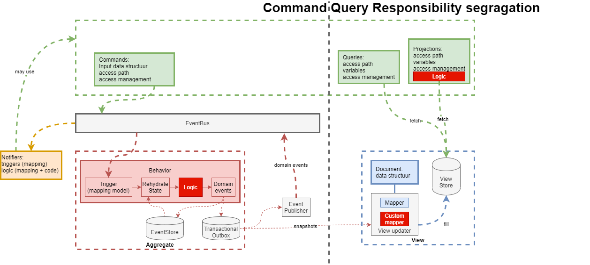

# Concept overview

In the diagram we mapped the relations between our concepts.

Gray elements represent technical concepts included to provide cohesion to the overall design, while all colored
sections depict modeling concepts. The red and white areas indicate custom code.

## Commands

Commands represent actions triggered by users or external systems. They encapsulate requests to perform specific
operations within the system. They are part of the API model in green.

## Aggregates and Behavior (pale red)

- **Event Sourcing**: This approach ensures that domain events, which capture immutable truths about past actions,
  remain unchanged over time. It separates the factual recording (event sourcing) from how we interpret and reason about
  these events (projection).
- **Technical Key**: This key is immutable and crucial for maintaining consistency in the system.

## Views and Queries

- **Projection of Truth**: While projecting the truth to execute domain logic is essential, querying involves a
  different perspective. It allows deviations in the data model and supports querying based on functional keys that can
  change over time (green).
- **Materialized Views**: These are separate read models optimized for queries. They are decoupled from the write model
  and offer benefits like converting technical keys to functional ones, optimizing data aggregations, and establishing
  relationships between entities that are otherwise decoupled (blue).

## Automations (also known as Notifiers)

Notifiers orchestrate commands in response to domain events without maintaining state. They have the capability to
invoke a wide range of web APIs, including AWS, REST, GraphQL, and the platform's own API (orange).

## Projections

Projections enhance queries by combining data from APIs, materialized views, and custom Python logic. They facilitate
transformations such as calculations, advanced filtering, or generating time-sensitive attributes (tokens).

## Custom code

The models can be augmented by Python code (bright red) to create functionality beyond the modelling concepts.

Advanced business logic should be implemented through programming because modeling it can add more complexity than it
solves, and
coding is faster for this purpose. However, it must be understandable for domain experts. Python is an ideal choice
because it is widely used by academics in fields like chemistry, biology, and data science. This increases the
likelihood that a domain expert can learn it, especially when we add "liberating constraints" from a methodology like "
tracepaper."