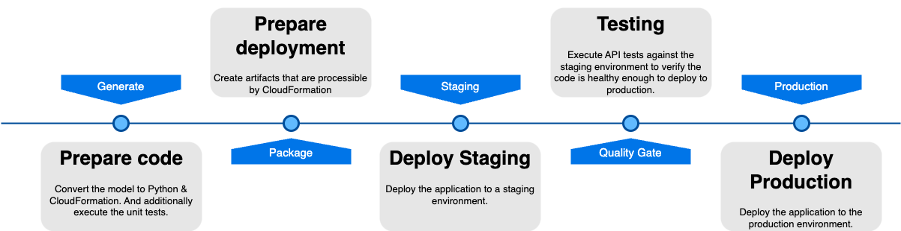

# Deployment Pipeline

This documentation outlines the steps involved in our deployment pipeline, explaining the purpose and necessity of each
step to ensure a smooth and reliable process from code generation to production deployment.

## Generate: Prepare Code

### Purpose

The `generate` step is crucial for converting high-level models into executable code and validating that code through
unit testing. This ensures that the code is correctly generated and functions as intended before moving further along
the pipeline.

### Process

1. **Model Conversion**: The high-level model, which defines the application's structure and behavior, is converted into
   Python code and CloudFormation templates. This step translates abstract models into concrete, executable code and
   infrastructure definitions.

2. **Unit Testing**: After the conversion, unit tests are executed to validate the functionality of the generated code.
   Unit tests help identify and fix issues early in the development process, ensuring that individual components of the
   application work correctly in isolation. (These are the modeled test cases in the behavior-flow models).

### Why It's Needed

- **Accuracy**: Ensures that the model is correctly translated into code.
- **Early Issue Detection**: Unit tests catch errors early, reducing the risk of bugs in later stages.
- **Validation**: Confirms that the generated code adheres to expected behaviors and standards.

## Package: Prepare Deployment

### Purpose

The `package` step involves preparing the application artifacts for deployment. These artifacts include all the
necessary files and configurations that CloudFormation requires to deploy the application infrastructure.

### Process

1. **Artifact Creation**: Collect and package the code, CloudFormation templates, and other necessary resources into
   deployable artifacts.
2. **Versioning**: Assign versions to the artifacts to manage releases and ensure consistency across different
   environments.

### Why It's Needed

- **Consistency**: Ensures that the same artifacts are deployed across different environments, reducing discrepancies.
- **Preparation**: Packages the application into a format that CloudFormation can process, streamlining the deployment
  process.

## Staging: Deploy Staging

### Purpose

The `staging` step involves deploying the application to a staging environment, which closely mirrors the production
environment. This allows for comprehensive testing and validation before the application is deployed to production.

### Process

1. **Deployment**: Use CloudFormation to deploy the application artifacts to the staging environment.
2. **Configuration**: Configure the staging environment to match the production setup as closely as possible. (e.g.
   manually load API secrets into the staging secrets manager)

### Why It's Needed

- **Validation**: Provides a realistic environment to test the application, ensuring it behaves as expected in a
  production-like setting.
- **Risk Mitigation**: Identifies and resolves issues in a controlled environment, reducing the risk of problems in
  production.

## Quality Gate: Testing

### Purpose

The `quality gate` step involves executing API tests against the staging environment to verify that the application is
stable, functional, and ready for production deployment. This step ensures that the code meets the required quality
standards.

### Process

1. **Cleanup**: Optionally, clear the environments databases and IAM role assignments.
2. **API Testing**: Execute functional and integration tests on the staging environment, focusing on the application's
   API endpoints. These tests are modeled using the Tracepaper tool.
3. **Validation**: Validate that all tests executed successfully.
4. **Coverage**: Validate that there is sufficient coverage regarding the published events in the domain and the view
   queries.

### Why It's Needed

- **Quality Assurance**: Ensures that the application meets quality standards and is free of critical bugs.
- **Verification**: Validates that the application behaves correctly under various scenarios and edge cases.
- **Readiness Check**: Confirms that the application is ready for production deployment.

## Production: Deploy Production

### Purpose

The `production` step is the final stage, where the application is deployed to the production environment. This step is
executed only after the application has passed all previous stages, ensuring a smooth and reliable deployment.

### Process

1. **Deployment**: Use CloudFormation to deploy the validated application artifacts to the production environment.
2. **Adviced: Monitoring**: Immediately start monitoring the production environment to detect and address any issues
   that may
   arise post-deployment. This is not provided by Draftsman, we ourselves use [Lumigo.io](https://lumigo.io) to monitor
   our applications.

### Why It's Needed

- **Go-Live**: Makes the application available to end-users.
