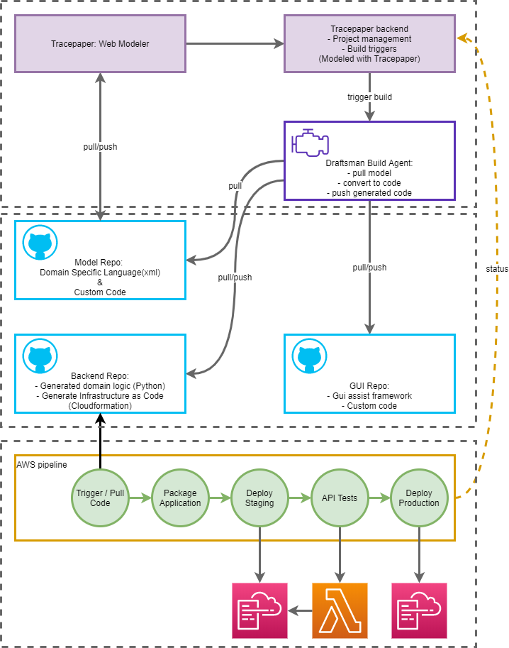

# Workflow and Ownership

The provided diagram illustrates the workflow and components of the Tracepaper system, detailing the integration between
modeling, code generation, and deployment processes, along with the ownership of each part of the infrastructure.

## Workflow Description

1. **Tracepaper: Web Modeler**
    - Users model their applications in the Tracepaper Web Modeler, which is used for project management and to set
      build triggers.
    - **Ownership:** Tracepaper

2. **Tracepaper Backend**
    - Manages project configurations and triggers builds based on the models created in the Web Modeler.
    - **Ownership:** Tracepaper

3. **Draftsman Build Agent**
    - The build agent pulls the model from the repository, converts it to Python and CloudFormation code, and executes
      unit tests. This generated code is then pushed to respective repositories.
    - **Ownership:** Tracepaper

4. **Model Repo**
    - Contains the domain-specific language (XML) and any custom code. This repository is synced with the Tracepaper
      backend and the Draftsman Build Agent.
    - **Ownership:** Client

5. **Backend Repo**
    - Stores the generated domain logic in Python and the infrastructure-as-code scripts (CloudFormation). These
      artifacts are prepared for deployment.
    - **Ownership:** Client

6. **GUI Repo**
    - Holds the GUI assist framework and custom code, ensuring the user interface aligns with the backend logic.
    - **Ownership:** Client

7. **AWS Pipeline**
    - This pipeline handles the entire deployment process:
        - **Package: Prepare deployment** - Packages the application artifacts.
        - **Staging: Deploy Staging** - Deploys the application to a staging environment.
        - **Quality Gate: Testing** - Runs API tests against the staging environment to ensure the application is
          functioning correctly.
        - **Production: Deploy Production** - Finally, deploys the application to the production environment if all
          tests pass.
    - **Ownership:** Client

This architecture ensures a seamless and robust development-to-deployment workflow, emphasizing testing, error handling,
and real-time client feedback.